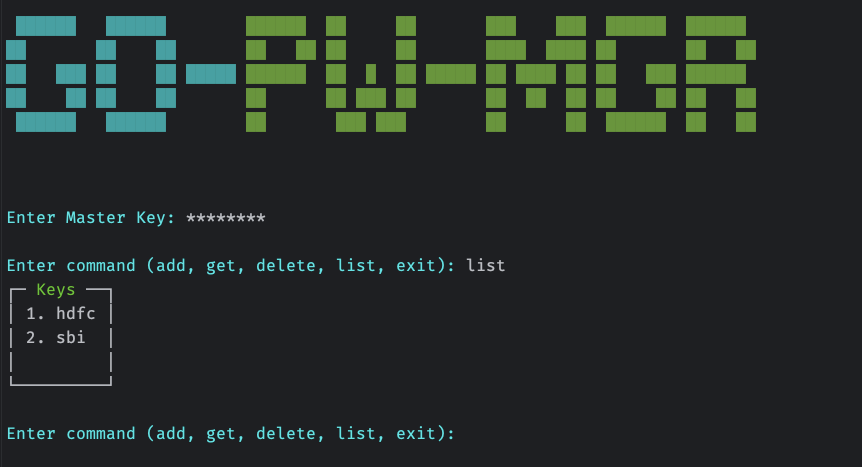
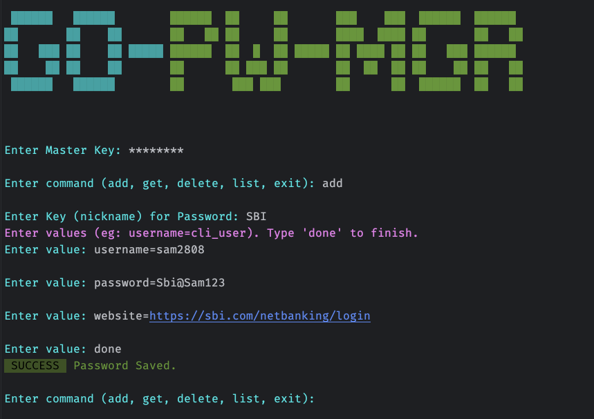
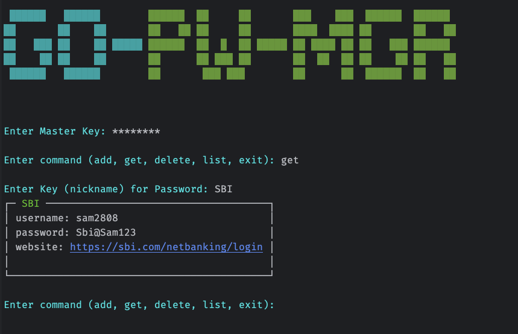
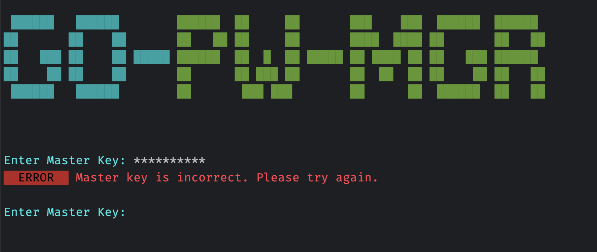

# GO Password Manager
A simple CLI password manager written in Go. This tool allows you to securely store, retrieve, list, and delete passwords using a master key for encryption and decryption.

## Features

- **Add Password**: Store a new password with a specified key.
- **Get Password**: Retrieve a password using its key.
- **List Password Keys**: List all stored password keys.
- **Delete Password**: Remove a password using its key.
- **Master Key**: Use a master key to encrypt and decrypt passwords before storing them in files.

## Security
- Encryption: Passwords are encrypted using the master key before being stored in files.
- Decryption: Passwords are decrypted using the master key when retrieved.

## Contributing
Contributions are welcome! Please open an issue or submit a pull request for any improvements or bug fixes.

## License
This project is licensed under the MIT License. See the LICENSE file for details.

## Screenshots
1. List Paassword Keys

2. Add Paassword

3. Get Paassword

4. Error

## Pending Tasks
- [ ] Show error message if user entry password entry in different format like abc:hello
